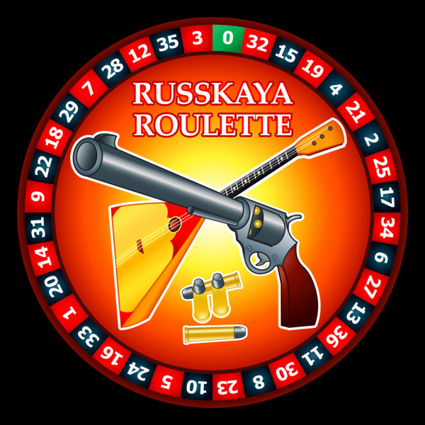

  

# RouletteBot
A Discord bot that kicks a random user from the server when called.

<a href="https://discord.com/api/oauth2/authorize?client_id=721577851458945085&permissions=268435494&scope=bot">
    Add to your Discord server:
     
    
</a>

## Deployment

## Setup
1. Clone repository using `git clone https://github.com/contejus/RouletteBot.git`.
2. Change directory using `cd RouletteBot/`
3. Create a `.env` file with the following contents:
    `DISCORD_TOKEN=<YOUR_DISCORD_TOKEN_HERE>`
4. Create a Discord bot and add your Discord token as well as a custom invite to allow the bot into your server.
5. Create a virtual environment with `python -m venv venv`.
6. Activate virtual environment with `source venv/bin/activate` on Linux or `source venv/Scripts/activate` on Windows.
7. Install requirements with `pip install -r requirements.txt`.
8. Run the bot with `python roulette.py`.

## Usage
1. Enter `!roulette` in Discord to randomly kick a member from the server the bot is in.

## Notes
- The bot will not/cannot kick the server owner. 
- The bot will not kick members whose highest roles are higher than the RouletteBot role. By default, RouletteBot's role is higher than the @everyone role. 
- The bot will stop if it cannot find an eligible member within MAX_ATTEMPTS tries, 10 by default. 
